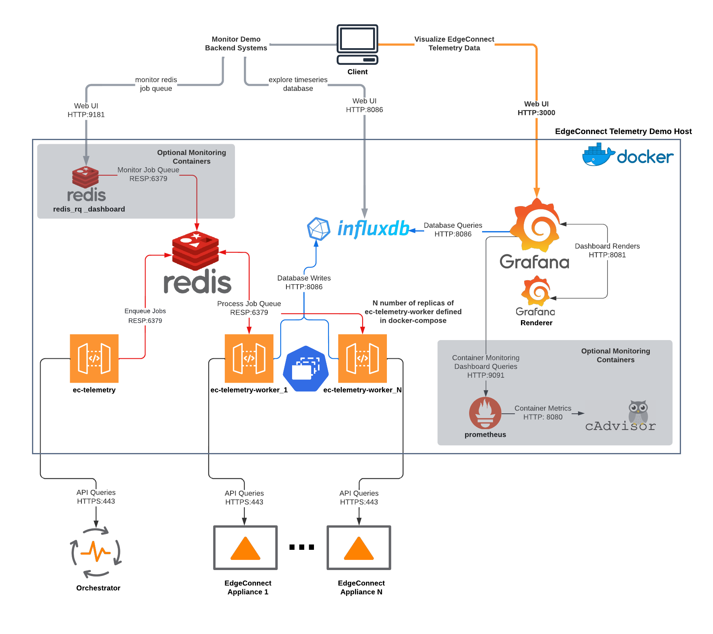
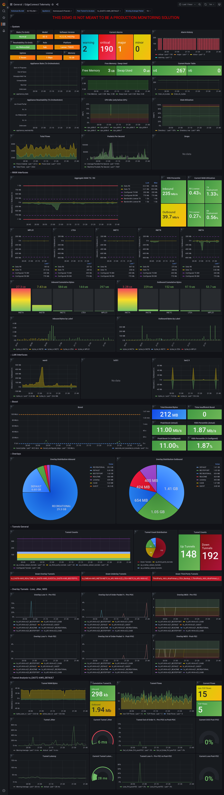
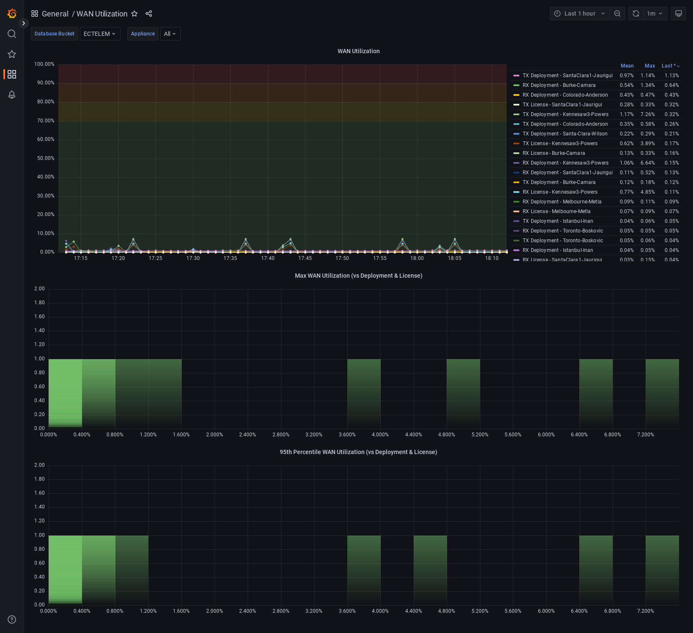
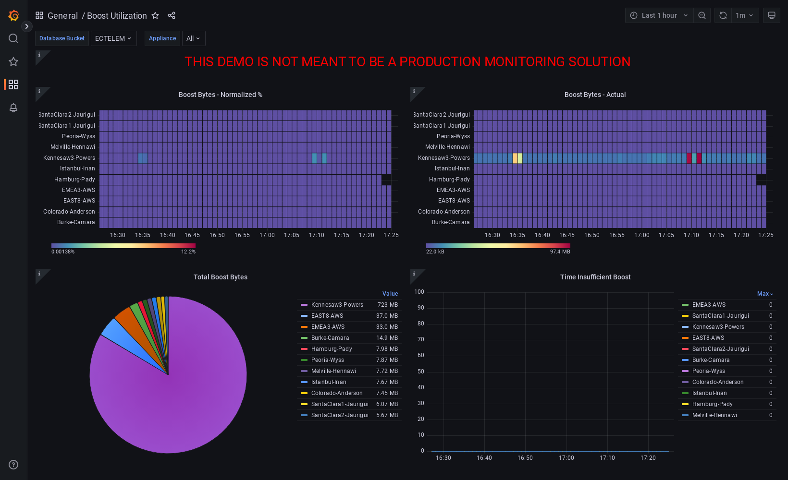
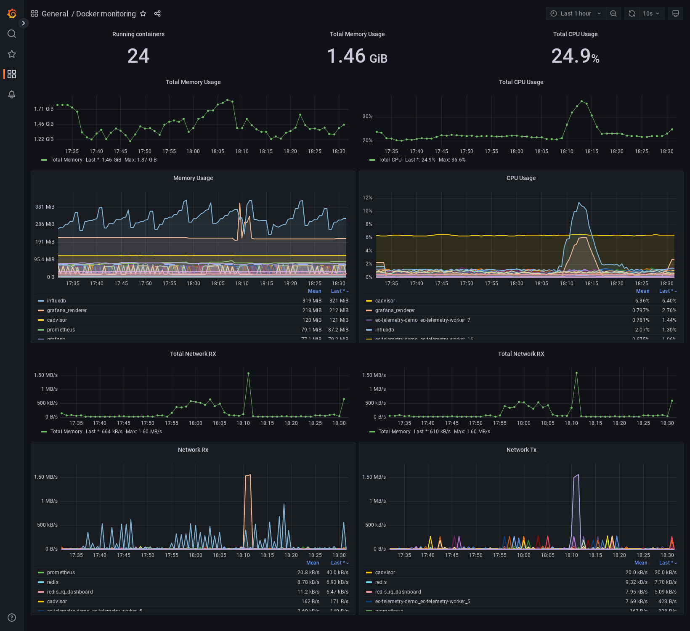

.. _ec_telemetry_demo:

EdgeConnect Telemetry API Demo
********************************

.. important::

    **THIS DEMO IS NOT MEANT TO BE A PRODUCTION MONITORING SOLUTION**

    This example code serves to demonstrate the possibilities in
    retrieving telemetry data from Orchestrator and EdgeConnect and
    visuzalize it. The demo is simple to run, however, modifying
    and/or incorporating components of this work into your own solution
    requires a greater understanding of Python, Docker, InfluxDB,
    Grafana, and Redis.

    All of these components are not necessarily required for developing
    your own solution as there may be pieces of data you don't need
    to collect, some additional others that you want to add,
    substitude alternative tools for task queuing, database, and
    visualization or alerting needs.

.. note::

    The code referenced in this document and all published examples
    with pyedgeconnect are available from the GitHub repository within the
    `examples <https://github.com/SPOpenSource/edgeconnect-python/tree/main/examples>`_
    folder. Each example script contains logic to authenticate to the
    Orchestrator as documented in the authentication example.

    Clone the repository and download the examples with:

    .. code:: bash

        $ git clone https://github.com/SPOpenSource/edgeconnect-python.git

Overview and System Prerequisites
-----------------------------------

This example code is meant to launch an external telemetry collection
and visualization demonstration for EdgeConnect SDWAN appliances.

A user can run this demo on any host system with Docker containers and
point it towards an Orchestrator instance for EdgeConnect SDWAN and
instantly begin visualizing many different pieces of data from
discovered appliances. Knowledge of the underlying systems, Python, or
other open-source software solutions leveraged in this demo is required.

For those looking for examples on how to collect this data, all of the
Python scripts used in the `ec-telemetry` and `ec-telemetry-worker`
containers can be reviewed and all the API endpoints used to collect
the data in the demo are documented in this overview.

If you want to get right to running it, jump to
`Required Configuration To Run Demo`_

To skip to example screenshots and dashboard overviews, jump to
`Dashboards`_

.. note::

    References for open-source tools used in this demo:
      - https://www.docker.com/
      - https://grafana.com
      - https://www.influxdata.com/
      - https://redis.com/

Architecture Overview
===============================

**Demo Application Architecture**

**Demo Directory Structure**

.. code::

    ├── app
    │   ├── ec-telemetry
    │   │   ├── ec_discover.py
    │   │   ├── ec_telemetry.py
    │   │   ├── limit_appliances.json
    │   │   └── requirements.txt
    │   ├── grafana
    │   │   ├── dashboards
    │   │   │   ├── boost_utilization.json
    │   │   │   ├── demo_monitor.json
    │   │   │   ├── ec_appliance.json
    │   │   │   └── wan_utilization.json
    │   │   └── provisioning
    │   │       ├── dashboards
    │   │       │   └── dashboard_provider.yml
    │   │       └── datasources
    │   │           └── datasources.yml
    │   ├── grafana_render
    │   │   └── config.json
    │   └── prometheus
    │       └── prometheus.yml
    ├── demo_cleanup.sh
    ├── docker-compose.monitor.yml
    ├── docker-compose.yml
    ├── Dockerfile
    └── example.env

System & Environment Requirements
==================================

Orchestrator & EdgeConnect
^^^^^^^^^^^^^^^^^^^^^^^^^^^^^^^^^

Due to many of the statistics collection data retrieval and formats,
the demo requires Orchestrator and EdgeConnect to be on 9.1 releases.
The data model for collecting bandwidth licensing levels is written
for the current tiered bandwidth model, appropriate numeric values
will not be displayed for legacy Base & Plus licenses.

.. list-table:: Supported Versions
   :header-rows: 1

   * - Orchestrator
     - EdgeConnect ECOS
   * - 9.1.3+
     - 9.1.1.3+

.. note::

  The API endpoint for collecting CPU metrics from an appliance requires
  read/write access to the appliance. As such the specified user for
  the containers to login to the EdgeConnect appliances needs to have
  and ``admin`` role rather than ``monitor``.

Demo Host & Docker
^^^^^^^^^^^^^^^^^^^^^^^^^^^^^^^^^

The system running the demo must have Docker Engine and Docker Compose
installed. The demo was tested using Docker Engine 20.10.17 and Docker
Compose 1.29.2.

This host system must have IP reachability to Orchestrator and
EdgeConnect appliances. The `ec-telemetry-worker` containers will
attempt to connect to the EdgeConnect management addresses as known by
Orchestrator.

See below links for installing Docker Engine and Docker Compose:

- Installing Docker Engine: https://docs.docker.com/engine/install/
- Installing Docker Compose: https://docs.docker.com/compose/install/

There are many guides online for installing Docker & Docker Compose
on different systems both from Docker directly as well as different
providers, blogs, etc.

CPU & Memory
^^^^^^^^^^^^^^^^^^^^^^^^^^^^^^^^^

The cpu and memory utilized by the demo will vary based on scale. The
InfluxDB container will use the most as it's memory-intensive and will
grow further based on volume of data stored and queries being performed
against it.

The other scale factor is the number of `ec-telemetry-worker` containers
chosen to be deployed. Each will consume 25-100MB of memory. The
worker containers have resource limits of 0.50 CPU and 300M Memory
per replica in the Docker Compose file included and can be modified
if necessary. Note that overly constraining cpu or memory to the worker
nodes will impact the telemetry collection.

In the included ``example.env`` file, the InfluxDB bucket data retention for the
demo is set to 3 days (``3d``). This can easily be altered the user's
preference to store data for longer or shorter periods following syntax
of ``h`` for hours, ``d`` for days, ``w`` for weeks, etc.

Data Granularity & Accuracy
^^^^^^^^^^^^^^^^^^^^^^^^^^^^^^^^^

While the minute stats data are stored on an appliance for
approximately 24 hours, other metrics included in this demo are
gathered at the point in time when the appliance is collected. While
the discovery container runs every minute to queue appliances to the
`ec-telemetry-worker` containers, there is no guarantee that the
worker containers will complete the task queue before the next round
by the discovery container.

Factors contributing to completing the appliance queue within a minute
include, but are not limited to, latency to reach appliances, the
number of deployed `ec-telemetry-worker` containers to work on the
queue, and overall host system resources where this demo is
deployed determining the maximum number of `ec-telemetry-worker`
containers.

.. note::

  Data manipulated in the dashboard queries included in this demo (bytes
  to bits, bits to megabits, summing or multiplying values, etc.) is
  best effort, but Orchestrator should be consulted as an authoritative
  source.

Resource Utilization Examples
^^^^^^^^^^^^^^^^^^^^^^^^^^^^^^^^^

.. list-table:: Demo VM Resource Configuration
   :header-rows: 1
   :stub-columns: 1

   * -
     - OS
     - CPU
     - Memory
   * - On-Prem VM
     - Ubuntu 20.04
     - 2 vCPU
     - 4GB

Equivalent cloud instances would be an AWS t2.medium or Azure
Standard_B2s.

All below system utilization stats are based on monitoring of on-premise
Unbuntu VM and are not guaranteed performance metrics. Please note that
the larger the dataset and/or time window being queried will impact
performance as these are per-minute statistics.

For example, a single statistic for one appliance in a 3-day window
would be returning 4,320 datapoints.

.. list-table:: Demo VM Observed Utilization
   :header-rows: 1
   :stub-columns: 1

   * -
     - 16 workers / 16 appliances*
     - 4 workers / 6 appliances
   * - CPU
     - 20-25%, ~500-600GHz
     - 10-13%,
   * - System Memory
     - 3GB
     - 2GB
   * - Container Memory
     - ~1-2.5GB
     - ~1-1.6GB
   * - Disk I/O
     - Max ~7-8MB/s, average ~0.3MB/s
     - tbd
   * - Docker Images
     - ~2.4GB
     - ~2.4GB
   * - Docker Volumes
     - ~1G with 3d of data**
     - ~800M with 3d of data**
   * - Total Disk Utilization (incl OS)
     - ~30GB
     - ~30GB

`*` ~1,000 total tunnels being captured in this demo environment

`**` 3d is default value in ``example.env`` file for bucket retention on
Influx and the value for Prometheus data retention in
``docker-compose.monitor.yml``

.. note::

  The above estimates include ~7% of cpu and ~400M of memory being used by
  cAdvisor and Prometheus monitoring the stack itself. These containers
  are optional for monitoring the container performance and only
  deployed with the additional ``docker-compose.monitor.yml`` file.

  Utilization can greatly vary by use, higher interaction with the
  Grafana dashboards, increasing refresh rate, leads to higher queries
  and increase utilization for Grafana and InfluxDB containers.

Containers & Versioning
===============================

.. list-table:: Demo Containers
   :header-rows: 1

   * - Container
     - Base Image
     - Host-mapped Ports
     - Intra-Container Ports
   * - ec-telemetry
     - Ubuntu 20.04 **
     - --
     - --
   * - redis
     - 4.0.6-alpine
     - --
     - 6379
   * - ec-telemetry-worker *
     - Ubuntu 20.04 **
     - --
     - --
   * - influxdb
     - 2.4.0
     - 8086
     - 8086
   * - grafana
     - 9.0.4
     - 3000
     - 3000
   * - grafana-renderer
     - 3.6.1
     - --
     - 8081

.. list-table:: Optional Monitoring Containers
   :header-rows: 1

   * - Container
     - Base Image
     - Host-mapped Ports
     - Intra-Container Ports
   * - redis_q_dashboard
     - Ubuntu 20.04 **
     - 9181
     - 9181
   * - cadvisor
     - cadvisor
     - 8080
     - 8080
   * - prometheus
     - prometheus
     - 9090
     - 9090

.. note::

  All containers in ``docker-compose.yml`` and
  ``docker-compose.monitor.yml`` are configured for restart
  ``unless-stopped``

  `*` Replica instances of `ec-telemetry-worker` container determined by
  environment variable ``$WORKER_COUNT``. All other containers are
  single instance.

  `**` All Ubuntu images are built from the Dockerfile in the root
  directory of the demo folder. In addition to the base image,
  ``iputils-ping``, ``dnsutils``, ``Python3``, ``pip``, and the
  following additional Python packages installed (as documented in
  ``app/ec-telemetry/requirements.txt``):

  .. code::

      pyedgeconnect
      influxdb_client == 1.30.0
      click >=7,<8
      Redis == 4.3.4
      rq == 1.11.0
      rq-dashboard== 0.6.1

Collection Process Logic
===============================

Discover Appliances from Orchestrator & Queue Collection
^^^^^^^^^^^^^^^^^^^^^^^^^^^^^^^^^^^^^^^^^^^^^^^^^^^^^^^^^^^^^^^^

#. ``ec_discover.py`` runs on the `ec-telemetry` container, and first
   checks if InfluxDB and Orchestrator are reachable (if not retries every
   3 seconds)
#. If reachable, proceeds to connect to Orchestrator and retrieves list
   of appliances with :func:`pyedgeconnect.Orchestrator.get_appliances`
#. Performs additional API calls to Orchestrator for interface label
   mapping, overlay configuration, and appliance licensing status/values

     * :func:`pyedgeconnect.Orchestrator.get_all_interface_labels`
     * :func:`pyedgeconnect.Orchestrator.get_all_overlays_config`
     * :func:`pyedgeconnect.Orchestrator.get_portal_licensed_appliances`
#. Checks ``limit_appliances.json`` file to limit telemetry collection
   to specified hostnames
#. The output from the additional API calls to Orchestrator is added to
   each appliance item in the appliance list
#. Each appliance in the appliance object in the appliance list is
   enqueued as a job to the Redis Queue
#. The process will repeat again in 60 seconds

Collect Data from EdgeConnect Appliances & Write to Database
^^^^^^^^^^^^^^^^^^^^^^^^^^^^^^^^^^^^^^^^^^^^^^^^^^^^^^^^^^^^^^

.. note::

  All tasks below are performed on an instance of the
  `ec-telemetry-worker` container for each appliance item they take from
  the Redis Queue

#. Write appliance metadata and reachability status to InfluxDB
#. Check if appliance management IP is reachable via ping (a response
   code of ``0`` is successful, ``256`` indicates unreachable)
#. If ping succeeds, login to the appliance with
   :func:`pyedgeconnect.EdgeConnect.login`
#. If login succeeds, begin telemetry collection with the following API
   calls:

     * :func:`pyedgeconnect.EdgeConnect.get_appliance_stats_minute_range`
     * :func:`pyedgeconnect.EdgeConnect.get_appliance_stats_minute_file`
     * :func:`pyedgeconnect.EdgeConnect.get_appliance_deployment`
     * :func:`pyedgeconnect.EdgeConnect.get_appliance_memory`
     * :func:`pyedgeconnect.EdgeConnect.get_appliance_cpu`
     * :func:`pyedgeconnect.EdgeConnect.get_appliance_subnets`
     * :func:`pyedgeconnect.EdgeConnect.get_appliance_alarms`
     * :func:`pyedgeconnect.EdgeConnect.get_appliance_all_tunnel_ids`
     * :func:`pyedgeconnect.EdgeConnect.get_appliance_all_bonded_tunnel_ids`
     * :func:`pyedgeconnect.EdgeConnect.get_appliance_all_3rdparty_tunnel_ids`
     * :func:`pyedgeconnect.EdgeConnect.get_appliance_disk_usage`
     * :func:`pyedgeconnect.EdgeConnect.get_appliance_system_info`
     * :func:`pyedgeconnect.EdgeConnect.get_appliance_realtime_stats`
#. On completion or tasks or if exceptions occur in communicating with
   appliance, the worker will log out of appliance via
   :func:`pyedgeconnect.EdgeConnect.logout`
#. All the data gathered from the appliance is written to the respective
   measurements in the InfluxDB database

Visualize Data in Grafana
^^^^^^^^^^^^^^^^^^^^^^^^^^^^^
- The Grafana container comes pre-populated with multiple dashboards to
  visualize the data collected. The JSON for the dashboards is in the
  ``app/grafana/dashboards`` directory
- The dashboards perform Flux queries to InfluxDB datasource to
  visualize the appliance data
- For more information on working with the InfluxDB Flux query language
  visit https://docs.influxdata.com/flux/

Required Configuration To Run Demo
-----------------------------------

Environment Variables
==========================

.. warning::

    If fully populated, the ``.env`` file could contain sensitive token
    information. To refrain from commiting token values to the local
    file, system environment values will take precedence over those
    referenced in the ``.env`` file. This host system can be setup with
    environment variables for ``ORCH_API_KEY``, ``EC_PW``, ``DB_TOKEN``,
    and ``DB_PW``, or any of the other environment variables referenced
    below for the containers without including them in the included
    ``.env`` file.

Docker-compose will automatically export variables in file named
``.env``. Existing environment variables of the host system will always
take precedence. Reference values included in ``example.env`` file as
shown below.

Docker-compose can use an alternate file with the
``--env-file`` option e.g., ``$ docker-compose --env-file example.env
up -d``

.. code::

  # It is recommended to not store sensitive auth/token information
  # in a static file, the below values are only present to document
  # the envrionment variable keys the containers will reference.
  # Environment variables on the host itself will take precedence
  # over any included here

  # Orch and EdgeConnect Connection Details
  ORCH_URL=<orchestrator_ip_or_fqdn>
  ORCH_API_KEY=<orch_api_key>
  EC_USER=<ec_username>
  EC_PW=<edgeconnect_password>
  # Token for Grafana/InfluxDB Communication
  # DB_USER and DB_PW used to login to both Grafana/InfluxDB
  DB_TOKEN=<database_token>
  DB_USER=admin
  DB_PW=<database_password>

  # Number of replica containers for ec-telemetry-worker
  WORKER_COUNT=4

  # OPTIONAL SETTINGS, KEEP DEFAULTS IF UNSURE

  # Project name and local logging settings
  COMPOSE_PROJECT_NAME=EC-Telemetry
  LOG_LEVEL=WARNING
  LOG_MAX_BYTES=1000000
  LOG_MAX_BACKUPS=5
  # Timeout to check reachability to EdgeConnect
  EC_TIMEOUT=2
  # Database Connection Details
  DB_ORG=ECTELEM
  DB_URL=http://influxdb:8086
  DB_BUCKET=ECTELEM
  DB_RETENTION=3d
  # OPTIONAL CUSTOM DNS SERVER FOR CONTAINERS
  # To use, un-comment the `dns:` option for containers in docker-compose.yml
  # DNS_SERVER=8.8.8.8

.. note::

    The API endpoint for collecting CPU metrics from an appliance
    requires read/write access to the appliance. As such the specified
    user for the containers to login to the EdgeConnect appliances needs
    to have and ``admin`` role rather than ``monitor``

Limit Appliances JSON File
===============================

By default, the telemetry script will gather data from the first four
reachable appliances returned by
:func:`pyedgeconnect.Orchestrator.get_appliances` and write the
hostnames to the file ``limit_appliances.json`` (located in
``app/ec-telemetry/limit_appliances.json``).

To specify which appliances to collect telemetry for in advance,
add the hostnames to the list ``appliance_subset`` in the
``limit_appliances.json`` file.

Default contents of ``limit_appliances.json`` file:

.. code:: python

    {
        "appliance_subset": [],
        "example": [
            "Hostname-01",
            "SITE-HQ-02",
            "MyAppliance-A"
        ],
        "comment": "List of appliance hostnames to limit telemetry collection to"
    }

Example contents below where the telemetry would only be collected
from two appliances ``REAL-HOSTNAME-01`` and ``REAL-HOSTNAME-02`` as
shown under the ``appliance_subset`` key:

.. code:: python

    {
        "appliance_subset": [
          "REAL-HOSTNAME-01",
          "REAL-HOSTNAME-02"
        ],
        "example": [
            "Hostname-01",
            "SITE-HQ-02",
            "MyAppliance-A"
        ],
        "comment": "List of appliance hostnames to limit telemetry collection to"
    }

The `ec-telemetry`` directory is copied to the containers on build and
not a mounted volume. If you wish to edit the ``limit_appliances.json``
file for collecting telemetry of different appliances, either modify the
copy within the `ec-telemetry-discover` container or modify the local
file and rebuild the containers with the ``--build`` option.

Logging & Monitoring
=========================

The python scripts for the ``ec-telemetry`` and ``ec-telemetry-worker``
containers will write to a centralized local log file located at
``app/logging/ec-telemetry.log`` on the host running the demo.

Check this file when running the demo to see the containers are
properly reaching Orchestrator, InfluxDB, and the EdgeConnect appliances.

The message levels and max file size will be determined by the
environment variables outlined in the Environment Variables section.
These default to logging evel of ``ERROR``, max file size of ``1MB``,
and rotating maximum of ``5`` log files as documented in the ``.env``
file.

.. code::

    LOG_LEVEL=ERROR
    LOG_MAX_BYTES=1000000
    LOG_MAX_BACKUPS=5

This will capture errors in the telemetry collection from Orchestrator
and target appliances.

example log message below for two appliances, ``EC-01`` and
``EC-02``:

.. code::

  2022-09-12 22:03:33,033 - ERROR - cid: de11e3d0706e - EC-01 @ 10.41.2.125 - 2.8259: FAILED TO LOGIN
  2022-09-12 22:03:34,271 - ERROR - cid: 1aa54222ea6b - EC-02 @ 10.41.0.70 - 4.0705: FAILED TO PING APPLIANCE -- ping response code: 256

The structure of the log messages are as follows:

``<date & time>`` - ``<log severity>`` - cid: ``<container id>`` -
``<EdgeConnect Hostname>`` @ ``<EdgeConnect IP>`` -
``<process timer>``: ``<log message>``

Monitoring the container performance/utilization can be performed with
the additional ``docker-compose.monitor.yml`` file as noted below which
will launch cAdvisor, Prometheus, and the data will be visualized in
an included dashboard in the Grafana instance.

In ``docker-compose.monitor.yml`` the included option for Prometheus
data retention period is set to 3 days as seen in
``--storage.tsdb.retention=3d``.

Run the demo
------------------------------

Once you've filled out the required details in your ``.env`` file or
configured respective environment variables on the host system to
point the demo towards an Orchestrator and EdgeConnect appliances,
the following commands will start the demo infrastructure and begin
telemetry collection.

.. code:: bash

    $ docker-compose up -d

.. note::

    If the user is not part of the docker group and you have to run
    the docker commands with `sudo`, host environment variables will not
    be passed to the sub-process. To pass them you must add the -E flag
    to sudo, e.g., ``$ sudo -E docker-compose up -d``

    Both methods can still be combined of host environment variables
    and a environment variables file as follows:
    ``$ sudo -E docker-compose --env-file example.env up -d``
    Where overlapping host environment variables take precedence with
    those in the ``example.env`` file.

If you make changes to the scripts or files in in the ``app/ec-telemetry``
directory (e.g. ``limit_appliances.json``) you'll want to have the
containers rebuilt with the ``--build`` option.

.. code:: bash

    $ docker-compose up -d --build

There is an optional compose file including cAdvisor and Prometheus to
monitor the resource utilization of the containers themselves. A
dashboard is also included in the grafana container to visualize this
data. To run the additional containers you can use the following syntax
to specify multiple compose files

.. code:: bash

    $ docker-compose -f docker-compose.yml -f docker-compose.monitor.yml up -d

To stop all containers

.. code:: bash

    $ docker-compose stop

To stop all telemetry collection workers but keep other containers
running to continue to explore collected data

.. code:: bash

  $ docker container stop $(docker container ls -q --filter name="ec-telemetry*")

To stop all containers and clean up volumes use the included
``demo_cleanup.sh`` script

.. code:: bash

  $ bash demo_cleanup.sh

Telemetry Documentation and Dashboards
---------------------------------------

Stats Collected / Processed in this Demo
=========================================

#. Orchestrator to Appliance state/reachability over time
#. Minute Stats Telemetry

   - tunnel stats
   - flow stats
   - boost stats
   - interface stats
   - drops stats (filtered for certain drop types)
   - interface overlay stats
#. Current memory use
#. Current CPU use (returns 5sec intervals for whole minute)
#. Current route table size
#. Number of active tunnels by type (underlay, overlay, third party)
#. Number of total down tunnels (max of 1000 logged per type)
#. Retrieve deployment - get configured WAN BW on interfaces
#. Static info -- HW Model, SW Ver, License, System BW
#. Alarm counts by type (Critical, Major, etc.)
#. Disk utilization
#. System info to retrieve appliance uptime
#. Realtime stats to calculate realtime packets per second at the time of
   collection

.. important::

  Alarms are collected directly from appliance, so if alarms have been
  modified or disabled in Orchestrator that will not be reflected in the
  data on this dashboard. E.g. Tunnel software version mis-match is disabled
  in Orchestrator, but the appliance locally has 4 minor alarms for
  tunnel software version mis-match, the dashboard will show 4 minor alarms
  while Orchestrator will show 0.

.. note::

    There are additional additional Minute stats files downloaded from the
    :func:`pyedgeconnect.EdgeConnect.get_appliance_stats_minute_file` API
    endpoint, and more continue to be added. While this demo does not use
    that data, more detail about the returned data for this function is
    available on DevHub
    https://developer.arubanetworks.com/edgeconnect/docs/examples

Dashboards
======================================

- `EdgeConnect Telemetry`_
- `System WAN BW For All Appliances`_
- `Boost Utilization for All Appliances`_
- `Docker Monitoring`_
- `How To Render/Export Dashboard Screenshots`_

When navigating the included dashboards, most panels have an info
description in the upper left corner with additional description
details of the panel. Click the (i) for description of the data being
presented.

EdgeConnect Telemetry
^^^^^^^^^^^^^^^^^^^^^^^^^^^^^^^^^^

Review many detailed metrics and statistics for a single appliance.

There are many sections of data on this dashboard, including overall
System stats, WAN and LAN utilization analysis, data over overlays,
tunnel counts and distribution, overlay tunnel pre & post FEC & POC, as
well as a dashboard variable to look at details for a specific tunnel
from the selected appliance.

.. list-table:: Dashboard variables
   :header-rows: 1

   * - Variable
     - Chained to
     - Description
   * - ``Database Bucket``
     - --
     - Lists discovered buckets in InfluxDB
   * - ``Appliance``
     - ``Database Bucket``
     - Choose appliance to populate dashboard data
   * - ``Peer Tunnel to Analyze``
     - ``Appliance``
     - Visualize tunnel details in ``Tunnel Analysis`` row
   * - ``WAN Labels`` *
     - ``Appliance``
     - Repeats WAN label graphs
       ``WAN Interfaces`` row
   * - ``LAN Interfaces`` *
     - ``Appliance``
     - Repeats LAN interface graphs
       ``LAN Interfaces`` row

`*` These dashboard variables are hidden as they are meant to be left
to the ``All`` value

System WAN BW For All Appliances
^^^^^^^^^^^^^^^^^^^^^^^^^^^^^^^^^^

System BW utilization graph for all appliances compared to deployment
values & license levels. This does not currently support legacy
Base & Plus licensing. Appliances with Unlimited licenses will not have
a utilization % calculated against the license, but all appliances
will calculate utilization % against the deployment system values.

This can help identify outliers of appliances that are running at
high utilization against their configured bandwidths or licenses.

The two lower histograms help identify where a majority of appliances
are transmiting as a max value within the speicifed time window as well
as their 95th percentile distribution in the same period.

.. list-table:: Dashboard variables
   :header-rows: 1

   * - Variable
     - Chained to
     - Description
   * - ``Database Bucket``
     - --
     - Lists discovered buckets in InfluxDB
   * - ``Appliance``
     - ``Database Bucket``
     - Leave ``All`` to visualize data for all appliances

Boost Utilization for All Appliances
^^^^^^^^^^^^^^^^^^^^^^^^^^^^^^^^^^^^^^

Cumulative Boost utilization for all appliances. One heatmap to show
a normalized view of % utilization of Boost used vs. amount configured,
as well as a heatmap of absolute values seeing which appliances are
using the most.

Notably the pie chart shows the cumulative utilization of boost for
all appliances in the time period, while the time series graph is able
to quickly pinpoint an outling appliances that experienced insufficient
Boost in the time period.

.. list-table:: Dashboard variables
   :header-rows: 1

   * - Variable
     - Chained to
     - Description
   * - ``Database Bucket``
     - --
     - Lists discovered buckets in InfluxDB
   * - ``Appliance``
     - ``Database Bucket``
     - Leave ``All`` to visualize data for all appliances

Docker Monitoring
^^^^^^^^^^^^^^^^^^^^^^^^^^^^^^^^^^

Monitor resource utilization of docker containers for demo including
total and per-container view of memory, cpu, and network activity

How To Render/Export Dashboard Screenshots
^^^^^^^^^^^^^^^^^^^^^^^^^^^^^^^^^^^^^^^^^^^

With dashboards sometimes including large amounts of panels that would
not fit on a screen, capturing screenshots of example data is difficult.
The `grafana-renderer` container is included to help render an image
of a full dashboard or panel.

**Render a dashboard or panel to a PNG image from cURL:**

1. Create a API key or Service Account with token on Grafana
(viewer permissions suffice)

2. Use the following syntax in a cURL command from a system that can
reach the grafana interface

.. code:: bash

  $ curl "http://${DOCKER_HOST}:3000/render/d/${DASHBOARD_UID}/${DASHBOARD_NAME}?orgId=1&var-db_bucket=ECTELEM&var-ec_hostname=${APPLIANCE_HOSTNAME}&var-tunnel_analysis_peer=${PEER_TUNNEL_NAME}&var-wan_labels=All&var-lan_interfaces=All&from=now-1h&to=now&width=1640&height=5400" -H "Authorization: Bearer ${GRAFANA_API_TOKEN}" --compressed > ${FILENAME}

Example with values filled in

.. code:: bash

  $ curl "http://my.docker.lab:3000/render/d/ec-appliance/edgeconnect-telemetry?orgId=1&var-db_bucket=ECTELEM&var-ec_hostname=SantaClara1-Jaurigui&var-tunnel_analysis_peer=to_WEST2-AWS_RECREATIONAL&var-wan_labels=All&var-lan_interfaces=All&from=now-1h&to=now&width=1640&height=5400" -H 'Authorization: Bearer abc123456789' --compressed > EC_DASHBOARD.png

3. The rendered dashboard will be downloaded

**Render a dashboard or panel to a PNG image from the GUI:**

Replacing appropriate values of the Grafana URL, dashboard ID and
name, along with any required dashboard variables, use the following
syntax in the browser to navigate to

.. code::

  http://${DOCKER_HOST}:3000/render/d/${DASHBOARD_UID}/${DASHBOARD_NAME}?orgId=1&var-db_bucket=ECTELEM&var-ec_hostname=${APPLIANCE_HOSTNAME}&var-tunnel_analysis_peer=${PEER_TUNNEL_NAME}&var-wan_labels=All&var-lan_interfaces=All&from=now-1h&to=now&width=1640&height=5400

